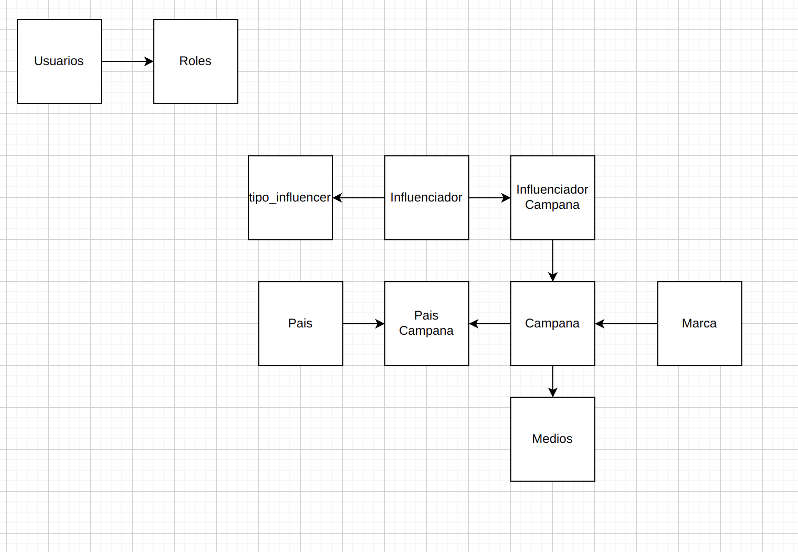

# SUPER USER

- user jmarinarango
- pass 2020

# ADMIN COMMANDS

For startapp commando you should register you app in settings.py file, in the array INSTALLED_APPS, later add [project]/urls.py to [app]/urls.py

    python3 manage.py runserver
    python3 manage.py shell
    python3 manage.py createsuperuser
    django-admin startproject [NAME]    # CREATE PROJECT (settings)
    python3 manage.py startapp [NAME] 	# DJANGO APP of project (MVC)

- [GRAPPELLLI ](https://github.com/sehmaschine/django-grappelli) Change Django styles-library
- [Django - libraries admin styles](https://djangopackages.org/grids/g/admin-styling/)

# MIGRATIONS

    python3 manage.py migrate
    python3 manage.py makemigrations
    python3 manage.py makemigrations first_app
    python3 manage.py sqlmigrate first_app 0001
    python3 manage.py migrate

    

## CONSOLE (DJANGO SHELL)

    python manage.py shell

    from first_app.models import Choice, Question
    from django.utils import timezone

    Question.objects.all()
    q = Question(question_text='pregunta 1', pub_date=timezone.now())
    q.save()

# DB / MODELS

- Add models to dash: 
  - [Documentation](https://docs.djangoproject.com/en/4.0/intro/tutorial07/) 
  - In admin.py [project](first_app/admin.py)
- [Django databases](https://docs.djangoproject.com/en/4.0/ref/databases/)
- [Many to Many relationship](https://www.sankalpjonna.com/learn-django/the-right-way-to-use-a-manytomanyfield-in-django)

# REST API
- [Django REST FRAMEWORK](https://www.django-rest-framework.org/)
- **Serializers**: Allow you to convert a class in json or xml format, they can validate any data, it's like the data structure  
- **ViewSets (Controllers)**: CRUD you can overrided some element of the CRUD
  - [Documentation](https://www.django-rest-framework.org/api-guide/viewsets/)
- JWT (JSON WEB TOKEN) digital signature
  - 

# FORMS

- It's better use crispy forms for templates
- [Messages framework](https://docs.djangoproject.com/en/4.0/ref/contrib/messages/), [example](/comment_app/templates/comment_app/contact.html)

# TEMPLATES
- URLS should be [project / url_namespace](comment_app/templates/comment_app/update.html)
- Bootstrap [you can use bootstrap in your code](https://data-flair.training/blogs/django-bootstrap/)
  - [Example](comment_app/templates/comment_app/contact.html)
  - [Crispy forms](https://simpleisbetterthancomplex.com/tutorial/2018/08/13/how-to-use-bootstrap-4-forms-with-django.html)
  - With forms and files is necesary to use multipart/form-data 
- Filters working by each value (rendering values adding something) {{ value|add:'2'}}

# LOGGING

- [Documentation](https://docs.djangoproject.com/en/4.0/topics/logging/)

# DEBUGGING

- [DJANGO DEBUG TOOLBAR](https://django-debug-toolbar.readthedocs.io/en/latest/)

# TEST

    python3 manage.py test Polls/tests

#  TIPS

- Imports are related to manage.py
  - [Example an import from another app](Polls/views.py)

# DOCUMENTATION 

- [swagger](https://drf-yasg.readthedocs.io/en/stable/readme.html)
  - [Explain video](https://www.youtube.com/watch?v=FvRfzQREXAY&t=1523s&ab_channel=Developer.pe)
  - Swagger search for viewsets.ModelViewSet and build the documentary automatically
- FILES INVOLVED 
  - [urls.py](dash_django/urls.py)
  - [settings.py](dash_django/settings.py)
  - [viewset.py](dash_app/viewsets.py)

# DASH API

Our project will have the next db structure

  